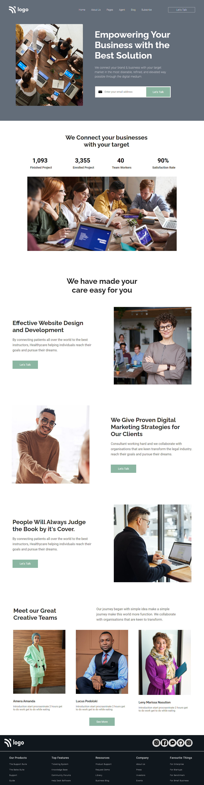

# Project-12
Bussiness Landing Page

Creating a webpage for a Business Firm

Hands-on Experience:
- Flexbox - 'Extensive Usage'
- Pseudo selectors
  - Hover
- Transitions
  - Delay
  - Ease-in, Ease-out
- SVG files Handling
  - Working on Figma
- Forms styling
  - Input
  - Placeholder
  - Buttons
- Introduction to measurement units
  - Pixels - px
  - Percentage - %
  - View-port reference
    - View-port height - vh
    - View-port width - vw
- Footer styling

